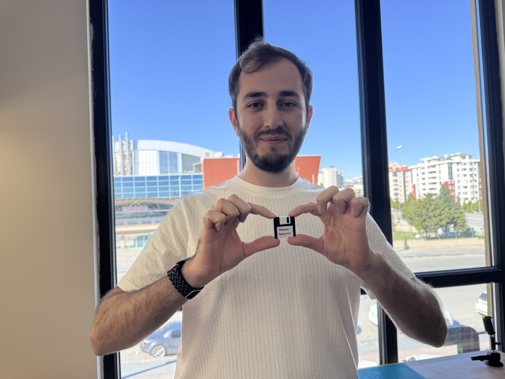

In this first guests-welcome event of Konya Hackerspace, [Safa](https://x.com/safaorhantr) introduces us hacking, hacker culture and hackerspaces.

<!--more-->

Carefully selected 30 potential hackers, got a mysterious invitation link to their inboxes:

https://partiful.com/e/XVNIMwtk3gBdberya6CW

```
You are invited to a secret party!

You will be a witness of something awesome coming together.

If you want to learn more, you have to come and find us!

13:30 - ✨ Party Begins
14:00 - 👾 Hack101 Presentation
15:00 - 🍕 Pizza + Networking
16:00 - 🚪 Party Ends
```

Some of them will come and witness the birth of Konya Hackerspace and some will regret missing this event for long years!

After doing a presentation about hackerspaces, we'll discuss the feasibility of opening and financing a physical space.

We'll see if Konya, the ancient capital city of Seljuks, is ready to host a hackerspace within!

---

## Photos





All other event photos and videos are shared with participants. Check your inboxes :)