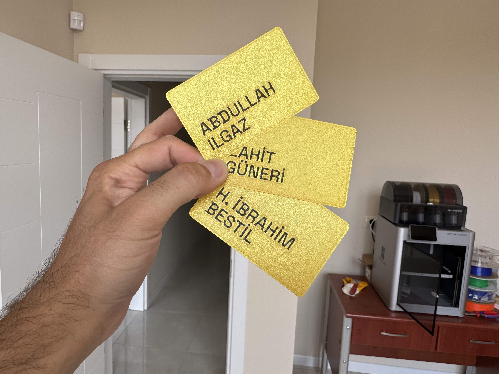
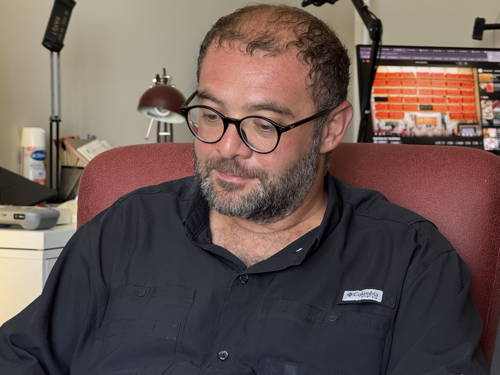
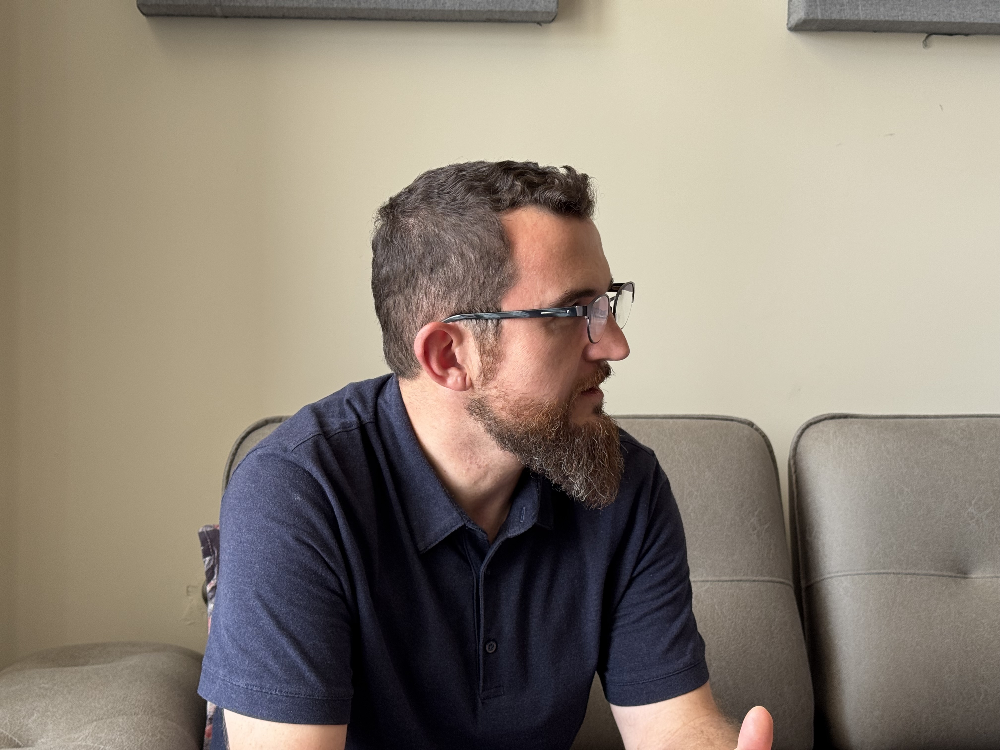

In this event [Safa](https://x.com/safaorhantr) introduces 3d printing pipeline to us, from designing a model, to slicing, printing, adding accesories and troubleshooting it.

<!--more-->

Using a template project, all participants model their member cards in Autodesk Fusion 360.

If all goes well, everyone have their member card printed, glued and functioning at the end of the session.

---

## Photos

