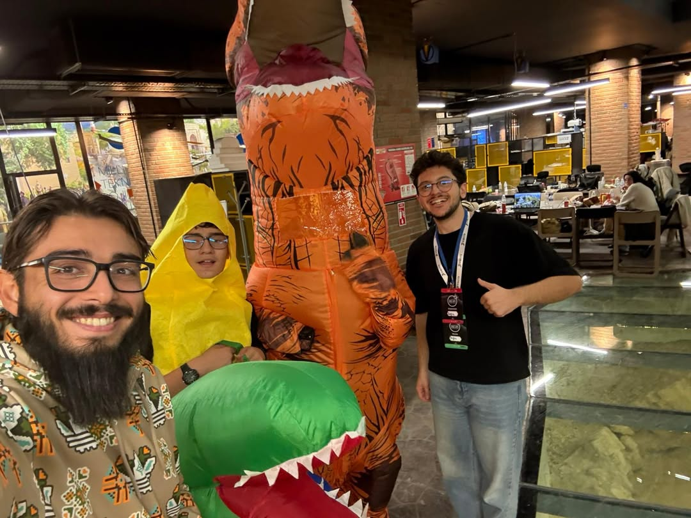
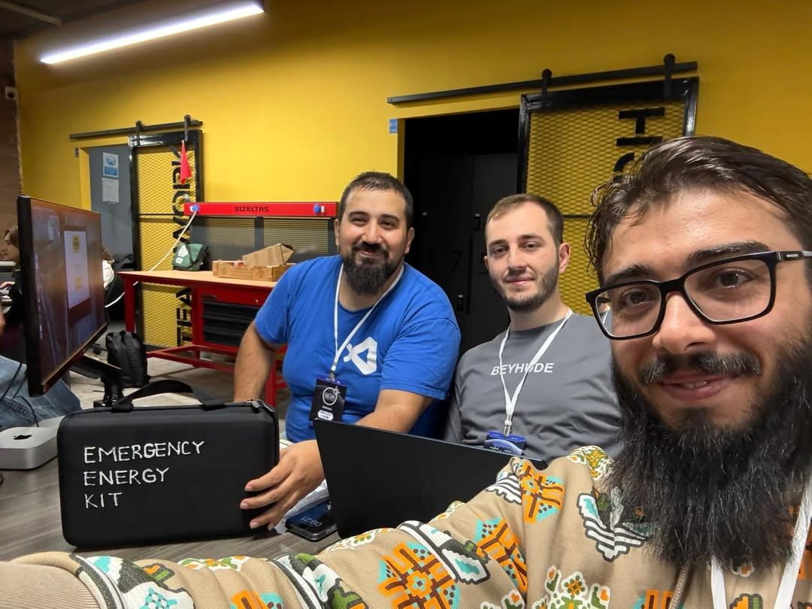
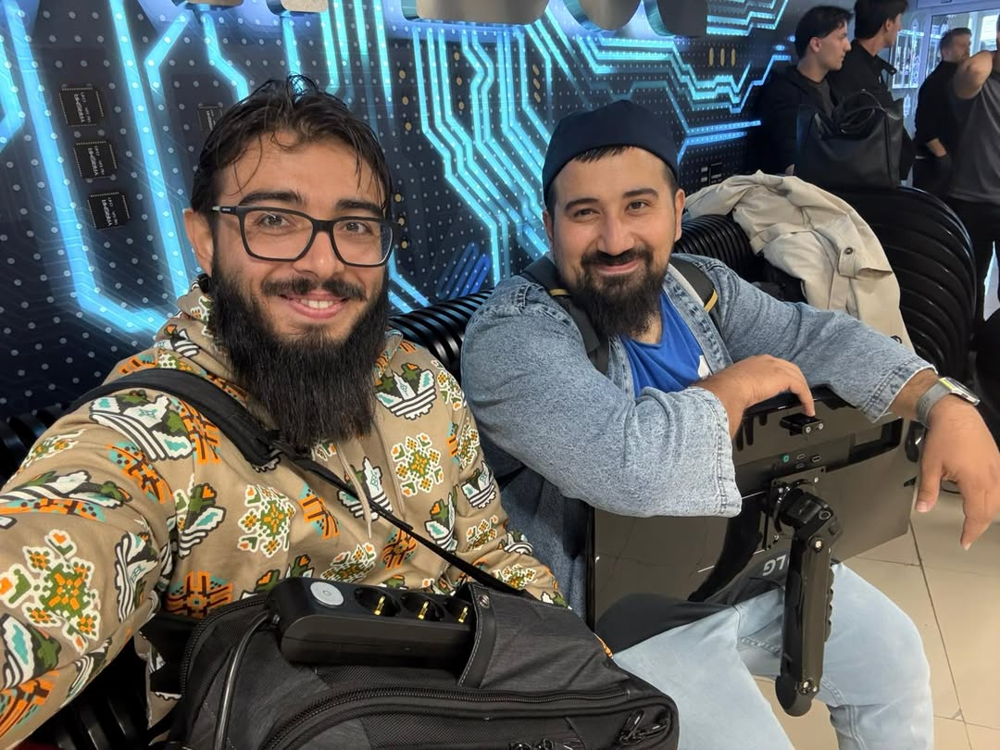
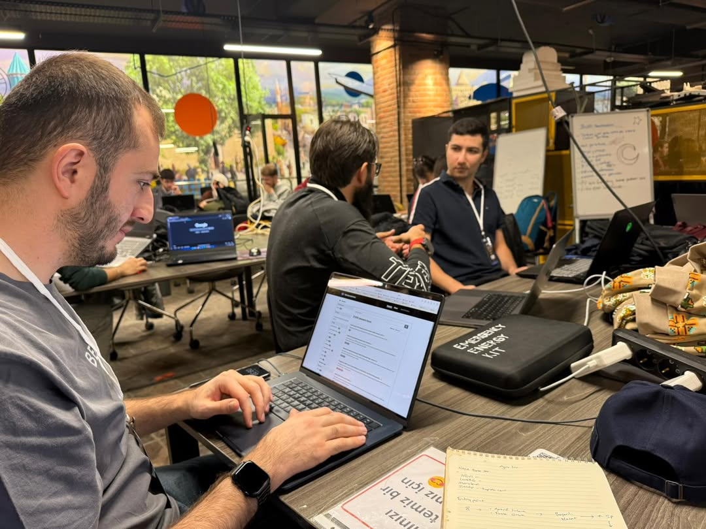
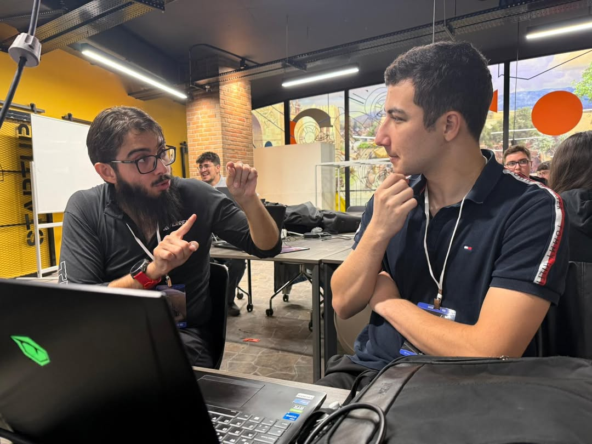
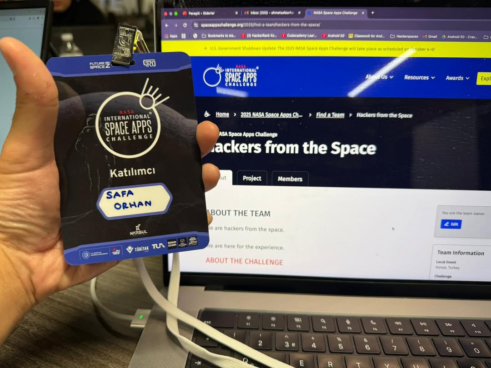

In this event, two teams from Konya Hackerspace participated in NASA Space Apps Challenge 2025, building projects with NASA's open data.

<!--more-->

## Team Hanzalabs: Agri Inc.

**Team Members:** Abdullah Ilgaz and Mehmet Taha Uyar

**Challenge:** NASA Farm Navigators - Using NASA Data Exploration in Agriculture

They built an educational farming simulation game using React. Players manage a wheat farm in Central Anatolia using real NASA precipitation and NDVI data from Konya region.

The game simulates four seasons with a ₺300 budget, where players make irrigation and fertilization decisions. It includes 3D animated field visualization and rewards sustainable farming practices.

**Links:** [Live Demo](https://agri-inc-bd279.web.app/) | [GitHub](https://github.com/mtuyar/agri-inc) | [Team Profile](https://www.spaceappschallenge.org/2025/find-a-team/hanzalabs/) | [LinkedIn Post](https://www.linkedin.com/posts/abdullahilgaz_space-apps-challenge-activity-7380300960167866368-k8lW)

---

## Team Hackers from the Space: Lake Tuz

**Team Members:** Safa Orhan, Ömer Faruk Öz and Ömer Kırkan

**Challenge:** Animation Celebration of Terra Data!

They created an interactive animated website showcasing how Lake Tuz changes colors throughout the year. Using satellite imagery from NASA's Terra satellite, they processed six years of weekly images with Python scripts and built animations with GSAP framework.

The project visualizes true color imagery from Terra's MODIS instrument, filtered by cloud cover, and includes land surface temperature measurements.

**Links:** [Team Profile](https://www.spaceappschallenge.org/2025/find-a-team/hackers-from-the-space/)

---

## What We Learned

This was our first participation in a global NASA hackathon. We learned how to work with satellite data, process large datasets, and transform scientific information into accessible formats.

Both teams approached NASA's open data differently - one through gamification, another through data visualization - showing the diverse possibilities of space technology applications.

It was inspiring to represent Konya in a global event and see local problems (Lake Tuz ecology, agricultural sustainability) being addressed with space technology.

---

## Photos

